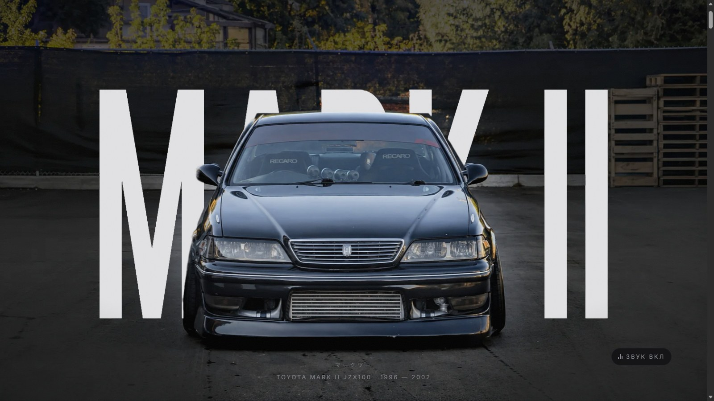
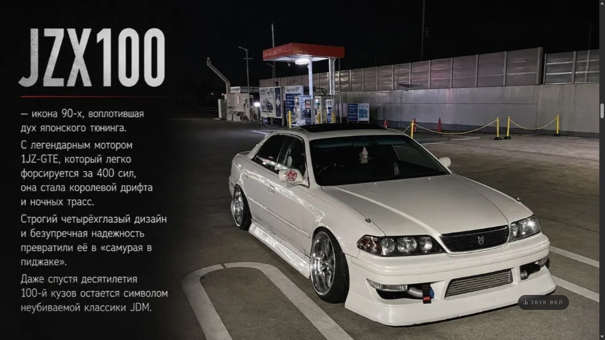
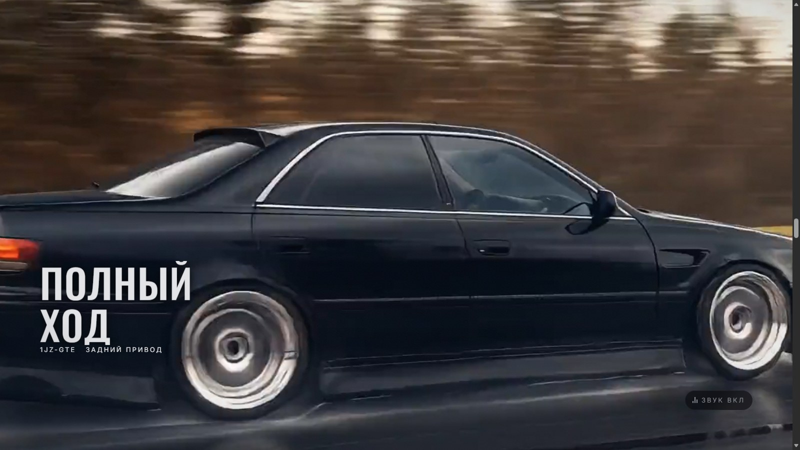
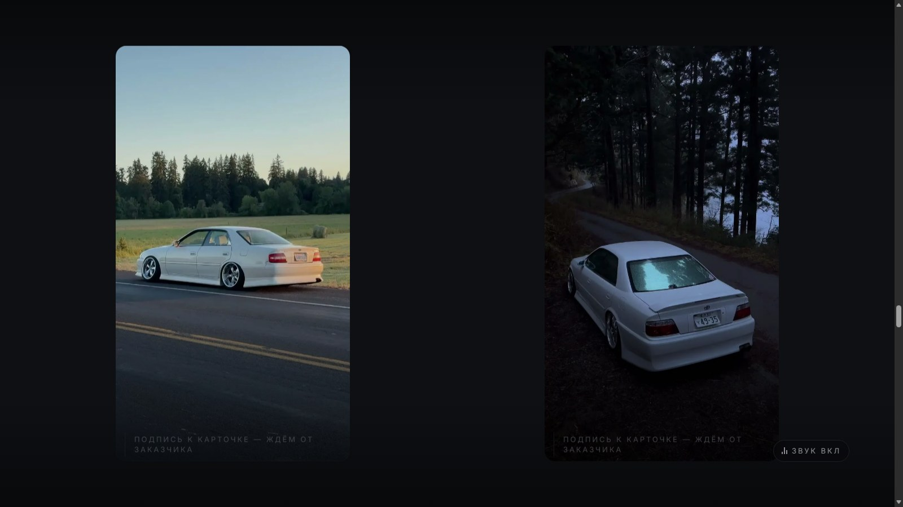
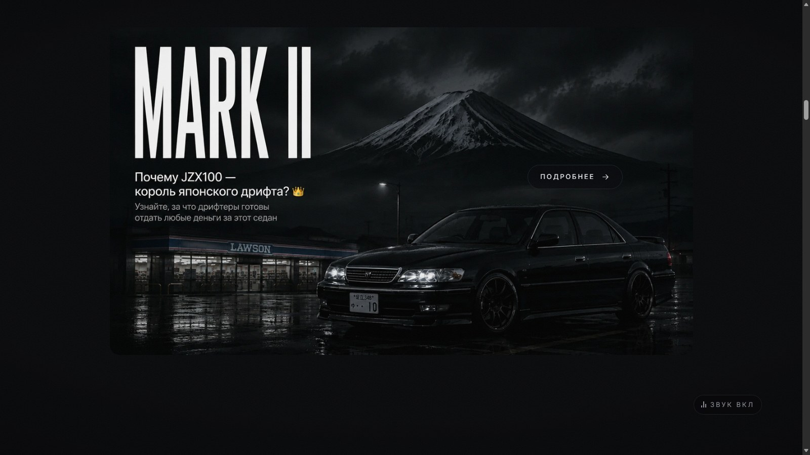

# Toyota Mark II JZX100

Одностраничный сайт-витрина о японском седане, который стал иконой дрифта.
Тёмный, сдержанный, без единой готовой темы и UI-библиотеки.

Читается он как один непрерывный проезд: разделов, которые листают, здесь нет —
есть сцена, которая меняется по мере прокрутки. Кадры появляются из черноты
и в неё же уходят, между ними стоят паузы, где не происходит ничего. Всё
движение привязано к прокрутке: отмотал назад — отмоталось и оно.



<table>
<tr>
<td width="50%"></td>
<td width="50%"></td>
</tr>
<tr>
<td></td>
<td></td>
</tr>
</table>

## Из чего собрано

| | |
|---|---|
| Сборка | Vite, без фреймворка — HTML, CSS и JavaScript |
| Движение | GSAP + ScrollTrigger, вся скролл-логика на них |
| Прокрутка | Lenis, инерционная |
| Шрифты | Oswald для заголовков, Inter для текста, локально |
| Материалы | ffmpeg и Pillow, скрипты в [tools/](tools) |

Ни одной UI-библиотеки, ни одной готовой темы, ни одного внешнего запроса
во время работы страницы.

Правила проекта и задание — в [CLAUDE.md](CLAUDE.md), материалы и как они
готовились — в [assets/README.md](assets/README.md).

## Запуск

```
npm install
npm run dev        # разработка
npm run build      # сборка в dist
npm run preview    # посмотреть собранное
```

Браузеру отдаётся только `assets/web`: он подключён как `publicDir`, поэтому
файлы оттуда лежат в корне адреса — `/hero-plate.webp`, `/card-1.mp4`.
Оригиналы из `assets` в сборку не попадают.

## Проверки

```
node tools/checks.mjs <адрес>         # поведение: карточки, звук, режим без движения
node tools/shots.mjs <адрес> <папка>  # снимки всех сцен в ключевых точках
node tools/perf.mjs <адрес>           # LCP, вес, частота кадров по сценам
```

Все три гоняют установленный в системе Edge через `puppeteer-core` и ничего
не скачивают. Сначала нужен запущенный `npm run preview`.

## Замеры

`node tools/perf.mjs` на машине с дискретной видеокартой:

| Показатель | Цель | Есть |
|---|---|---|
| LCP | < 2.5 с | 0.5–0.7 с |
| Вес всего загруженного на первом экране | < 3 МБ | 1.35 МБ |
| Частота кадров на сценах, 95-й процентиль | 60 | упирается в потолок экрана |

Средняя частота кадров в этом замере врёт — в headless нет синхронизации
с экраном. Смотреть надо на худший кадр: он показывает, где сцена
проваливается. До правок такие провалы были на первом экране (13 кадров
в секунду на уходе надписи) и на третьем (27 на пике смаза); сейчас ни одна
сцена не опускается ниже полутора сотен.

## Что где

```
index.html            разметка шести экранов, пауз между ними, прелоадера
src/main.js           точка сборки: подключает стили и заводит экраны
src/styles/tokens.css цвета, шрифты, отступы, длительности — единственный источник
src/js/motion.js      Lenis, ScrollTrigger, общие приёмы движения
src/js/space.js       первое пространство: лента вбок
src/js/street.js      второе пространство: развороты сверху вниз
src/js/cult.js        третье пространство: лента вбок на живом фоне
src/js/soul.js        четвёртое пространство: лента вбок волной
src/js/audio.js       состояние звука и его запоминание
tools/                подготовка материалов и проверки
```

Экран — это `section.screen`, пауза между экранами — `section.gap`. Пауза пустая
намеренно: там место под текст, которого ещё нет, и в неё же уходят и из неё
появляются соседние сцены.

## Состояние

Готово: подготовка материалов, каркас и токены, инерционная прокрутка,
экраны 1–5 целиком, паузы между слайдами, два отдельных пространства с
переходами из пауз, прелоадер, переключатель звука, мобильная раскладка.

Текст пятого экрана написан на стороне исполнителя по заданию из CLAUDE.md
и ждёт вычитки заказчиком. Кадры под левую колонку там временные — взяты
из уже готовых материалов.

Пространств три, и устроены они по-разному намеренно.

Первое, «Почему JZX100 — король японского дрифта», открывается кнопкой
«Подробнее» из первой паузы и едет вбок одной непрерывной лентой.

Второе, «Keep it street», открывается из второй паузы и идёт сверху вниз
разворотами: экран делится пополам — кадр во весь рост на одной половине,
ровный фон с крупной репликой на другой, — а между разворотами лежат мозаики
из кадров и полосы во весь экран.

Третье, «Культ JDM», открывается из той же второй паузы: карточек там теперь
две, одна под другой. Лента снова едет вбок, но всё остальное другое — под
ней идёт живой фон, один на всё пространство, панели разной ширины,
а кадры разбросаны по высоте вместо ровных галерей.

Четвёртое, «Душа машины», открывается из третьей паузы. Лента тоже едет вбок
и тоже на живом фоне, но идёт волной: текстовые панели прижаты к нижнему краю
экрана, кадры — к верхнему, и у каждого кадра снизу подпись мелким кеглем.
Тон тише остальных: заголовки строчными, акцента почти нет.

Шестой экран стоит на заглушке.

От заказчика ещё не пришли:

- название проекта и логотип;
- подписи к двум карточкам четвёртого экрана;
- четыре кадра под левую колонку пятого экрана;
- текст в паузы между слайдами;
- вертикальный вариант иллюстрации — нынешняя нарисована под широкий экран
  и на телефоне выходит мелкой;
- финальный кадр, контакты и соцсети;
- домен.

### Расхождение в датах

На материалах заказчика напечатано «1996 — 2002», и эта подпись стоит
на первом экране. Сотый кузов Mark II выпускали с сентября 1996 по октябрь
2000 года, дальше шёл X110. В тексте пятого экрана стоит 2000. Нужно решить,
что верно: либо поправить подпись, либо объяснить, что означает 2002 —
возможно, имелся в виду не кузов, а что-то другое.

Не сделано: прогон в Safari и Firefox, деплой.

## Решения, которые стоит помнить

**Слои первого экрана лежат в коробке пропорций исходного кадра.** Буквы
размечены в долях кадра, и без общей коробки они разъезжались бы с фоном
на каждом соотношении сторон окна.

**На мобильных широкий кадр первого экрана не обрезается по высоте.**
При обрезке под вертикаль от надписи MARK II не остаётся ничего.

**Приближение на втором экране ограничено 1.25.** Исходник 1280×720, дальше
заметно сыпется резкость. Из-за этого текстовый блок на входе уходит за край
не целиком.

**Смена кадров на пятом экране идёт по линии чтения, а не диапазонами.**
Блоки короткие, отступы между ними огромные — узкий диапазон на блок
проскакивался целиком, и кадр застревал на предыдущем.

**`scrub` задаёт каждая сцена сама, общего значения по умолчанию нет.**
`ScrollTrigger.defaults({ scrub: 1 })` наследовали и появления элементов:
привязанное к прокрутке появление не доигрывает до конца, и элемент навсегда
остаётся сдвинутым на десяток пикселей. На глаз это почти не видно, поэтому
в `tools/checks.mjs` есть отдельная проверка, что карточки доезжают до места.

**Фоновые ролики первого и третьего экрана перематывает прокрутка.**
Положение в ролике — это положение на странице: прокрутил назад, ролик
отмотался назад. Из этого следуют три решения при пережатии: ключевым делается
**каждый** кадр, ролик достраивается до шестидесяти кадров, и ход вперёд-назад
в файл не запекается — назад отматывает сам скролл. Подробности —
в [assets/README.md](assets/README.md).

Сплошные ключевые кадры — не перестраховка. При интервале даже в три кадра
браузер на каждый шаг доставал опорный кадр и достраивал от него; картинка шла
ступеньками и отставала тем сильнее, чем быстрее крутят. Ролик тяжелеет примерно
вдвое, и это единственная цена.

**Перемотка идёт по одной за раз.** Раньше время назначалось на каждом кадре
анимации. Браузер отрабатывает перемотку не мгновенно, запросы копились
в очереди, и видео ползло следом за прокруткой, отставая всё сильнее. Теперь
следующий запрос уходит только после ответа на предыдущий, а промежуточные
положения не копятся, а перетирают друг друга: браузер всегда едет туда, где
прокрутка сейчас, а не туда, где она была. Плюс срок ожидания: без него
потерянный ответ вешал бы сцену намертво.

**Тяжёлый ролик грузится на подходе, а не со страницей.** Ролик третьего экрана
стоял с обычным `src` и скачивался вместе с первым экраном — три мегабайта
за два экрана до того, как понадобится. Первый экран весил 4.65 МБ вместо
обещанных трёх. Адрес подставляется скриптом за три экрана до сцены; вес
первого экрана — 1.9 МБ.

На финальном экране ролика нет: там стоит кадр. Я однажды поставил туда петлю
по методичке — заказчик этого не просил и попросил вернуть как было.

**Оба ролика достроены до 60 кадров.** Тридцать кадров на двухсекундный
ролик — это шестьдесят разных картинок на весь ход сцены, и шаг между ними
виден как ступенька. Прежнему проезду третьего экрана достройка была
противопоказана — межкадровый расчёт рвал фон блоками на кустах и разметке;
нынешний считается чисто, проверено покадрово.

**Смаза на третьем экране больше нет.** Он был нужен, чтобы спрятать стык
между фотографией и роликом: на пике размытия подмена не читалась. Прятать
стало нечего — фотография вырезана из самого ролика, — а полноэкранное
размытие, пересчитываемое каждый кадр, стоило сцене двух третей частоты
кадров. Разгон остался: его держит боковой сдвиг, одно преобразование,
которое не стоит ничего.

**Крупность кадра третьего экрана задаётся отдельно от бокового сдвига.**
Раньше она из сдвига и вычислялась — и когда сдвиг уменьшили, кадр вместе
с ним отъехал, машина стала мельче. Такие связки между несвязанными
величинами дают правки, которых никто не просил.

**Подмены фото на видео не существует.** Статичный кадр третьего экрана —
это первый кадр лежащего рядом ролика, вырезанный из уже пережатой копии:
совпадают не только композиция, но и цвет после кодека. Меняются два
одинаковых кадра.

Одного этого мало. Ролик раньше начинал перематываться за треть сцены до
подмены — фотография показывала первый кадр, а ролик под ней успевал уехать
на четверть, и в момент подмены картинка прыгала. Пока лежит фотография,
ролик стоит на нуле.

**Полноэкранное размытие — самая дорогая вещь на сайте.** Уход надписи
на первом экране шёл с радиусом 18 пикселей по слою размером в окно, и первое
же движение на сайте проваливалось до тринадцати кадров в секунду. Восемь
пикселей выглядят так же (размытие здесь и задумано лёгким), а сцена держит
свои кадры. Проверять этим: `node tools/perf.mjs` — он показывает худший кадр
и то, на какой доле сцены он случился.

**Два запаздывания складываются.** Инерция прокрутки (`lerp`) и запаздывание
сцены (`scrub`) — это разные механизмы, и настраивал я их порознь: 0.045 и 1.6.
Вместе они давали почти секунду отставания от руки, и на таком отставании любой
пропущенный кадр читается как рывок — глаз ждёт одного, а получает другое.
Сейчас 0.07 и 1.0: инерция заметна, но страница идёт за рукой, а не следом.

**У переключателя звука видно состояние, а не только подпись.** Выключенный
отличался высотой трёх полосок и оттенком серого — на тёмном фоне разницы нет.
По кнопке щёлкали, думая, что включают звук, а выключали; выбор запоминается,
и дальше сайт молчал всегда. Теперь выключенный звук перечёркнут.

Право на звук даёт любое нажатие, а не только кнопка входа: прелоадер можно
и не увидеть — он снимается по таймауту, его нет в режиме без движения,
его нет при перезагрузке посреди страницы.

**Доли на шкале сцены — это доли прокрутки только тогда, когда шкала длиной
в единицу.** GSAP растягивает на прокрутку всю длину шкалы, а не первую её
единицу. У второго экрана последнее движение кончалось на 0.55, шкала на этом
и обрывалась — вход, размеченный как первые тридцать процентов, занимал больше
половины секции, а вся сцена сжималась в остаток и проскакивала. Лечится пустой
паузой в хвосте. Проверять стоит каждую сцену: несовпадение не видно в коде
и выглядит как «анимация тормозит, а потом дёргается».

**Кромка вместо растворения работает не везде.** На первом экране ролик
открывается снизу вверх мягкой кромкой — тем же ходом, каким приходит следующий
слайд. Наехать он не может: его первый кадр и фотография — один и тот же кадр,
и при сдвиге композиция задваивалась бы. Двигается поэтому не ролик, а граница,
за которой он виден. На вертикальном экране кромки нет вовсе: там фотография
вписана в рамку, а ролик занимает экран целиком, и граница прошла бы между
двумя разными крупностями одного кадра — на мобильных остаётся растворение.

**Последняя секция должна быть длиннее экрана.** Ровно на 100svh её верх
дотягивался до верха окна только в самой крайней точке прокрутки, а растворение
кромки идёт со сглаживанием и до нуля не доходило никогда: финал так и оставался
приглушённым, и докрутить его было некуда. Запас в 40svh даёт стыку закончиться
задолго до конца страницы.

**Между слайдами стоит пустота, и это решение заказчика, а не оплошность.**
Сначала слайды шли сплошной лентой: каждый следующий заходил на предыдущий,
и растворялась только его верхняя кромка. Потом понадобилось место под текст —
пустоту вернули нарочно. Секции `.gap` высотой в экран, чёрные, пустые; текст
кладётся внутрь `.gap__inner` и встаёт по центру узкой колонкой. Пустой
`.gap__inner` не рисуется, поэтому сейчас там ровно чернота.

Отдельная история — сколько эта пустота должна занимать. При 60% экрана паузы
не выходило: следующая сцена начинала проступать снизу раньше, чем предыдущая
уходила сверху, и вместо пустоты получался затянутый стык. Работает от целого
экрана — тогда есть отрезок, где в окне нет ничего.

**Стык теперь держит прозрачность сцены, а не маска на кромке.**
Растворять кромку стало не во что: под ней не предыдущий слайд, а фон
страницы. Зато и не нужно — сцена появляется из черноты и в неё же уходит,
прозрачностью целиком (`fadeScene`). Расчёт на совпадение: пока верхняя кромка
на экране, сцена почти прозрачна, а к полной непрозрачности приходит уже
развёрнутой на весь экран. Кромки не видно ни разу, хотя специально для неё
ничего не делается. И это одно число на слой — самая дешёвая анимация
из возможных, а поверх идут сцены, которым нужен каждый кадр.

Текстовые разделы и карточки так не трогаются: у них своё появление, а гасить
читаемый текст на въезде и выезде — значит мешать его читать.

Путь сюда был через три ошибки, и каждая стоит того, чтобы её не повторять.
Сначала я гасил сцены в чёрный по краям секции — но тогда слайды ещё шли
внахлёст, и пока сцена гасла, следующая не успевала дойти до экрана. Потом
навесил размытие фильтром прямо на сцену — замутнился весь слайд, а не переход.
Потом положил дымку отдельным слоем на всё окно — эффект стал жить в переходе,
но накрывал целый экран.

От той истории остался `--seam-overlap`: сейчас им задаётся только ход кромки,
которой на первом экране открывается ролик.

Мерить это на глаз бесполезно — резкость стыка считается по строкам кадра:
до правки перепад яркости между соседними строками был 70 единиц, после — 3.
По той же причине у второго экрана убран уход в глубину: кадр там уменьшался
и гас в ноль.

Чтобы такое ловить, есть проход по всей странице шагом в треть экрана
с подсчётом доли пикселей фона. Экран, занятый фоном целиком, — это провал;
текстовый раздел с его 75% фона — норма.

## Публикация

Хостинг - Cloudflare Pages, домен mark2.xyz.

Сборка: `npm run build`, каталог с результатом - `dist`. Заголовки кеширования
лежат в `assets/web/_headers` и попадают в корень сборки как есть (этот каталог
у Vite назначен publicDir).

Cloudflare Pages пересобирает сайт сам при каждой отправке в ветку `main`
на GitHub. Если сборка на их стороне окажется слишком долгой - в репозитории
лежат оригиналы видео, около полугигабайта, - есть запасной путь: собрать
локально и отправить только результат:

    npm run build
    npx wrangler pages deploy dist --project-name=mark2

Пределы бесплатного тарифа, в которые сайт укладывается: 25 МБ на файл
(самый тяжёлый - 11.3 МБ), 20 000 файлов на сборку (сейчас 324),
500 сборок в месяц. Трафик не ограничен - для сайта, где 168 МБ занимают
видео и музыка, это и было главным доводом.
